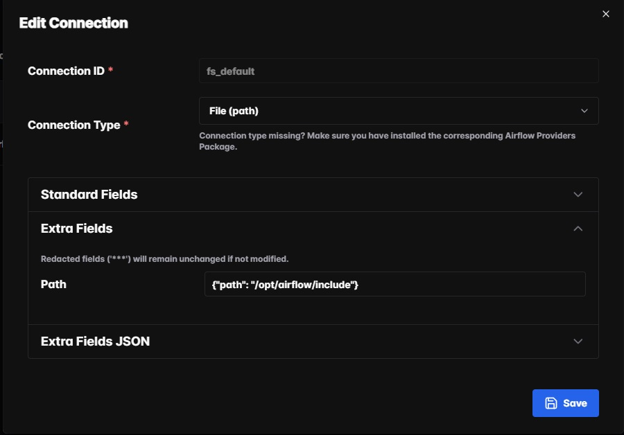

# Visão Geral do Projeto

O ecommerce-pipeline é uma pipeline de dados completa, que simula um e-commerce, desde a geração de dados sintéticos até a análise em dashboards.
Objetivos principais:

  - Simular dados realistas de usuários, produtos, pedidos e pagamentos.
  - Automatizar a ingestao diaria dos dados com Airflow.
  - Armazenamento inteligente em um data lake.
  - Processar dados distribuídos com PySpark.
  - Garantir qualidade de dados com Great Expectations.
  - Persistir dados confiáveis no Data Warehouse (PostgreSQL).
  - Monitorar e visualizar métricas de processos com Grafana e Prometheus.

---

## Stack Tecnológica

- **Orquestração:** Apache Airflow 3.0
- **Containers:** Docker Compose
- **Armazenamento de dados:** MinIO (buckets `raw` e `processed`)
- **Processamento:** PySpark (distribuído)
- **Formato de dados:** CSV e Parquet
- **Data Quality:** Great Expectations
- **Data Warehouse:** PostgreSQL
- **BI / Visualização:** Metabase
- **Monitoramento e métricas:** Grafana + Prometheus
- **Linguagem:** Python 3.12

---

## Estrutura do Projeto

```lua
├── docker
│   ├── airflow
│   │   ├── Dockerfile
│   │   └── requirements.txt
│   ├── prometheus
│   │   └── prometheus.yaml
│   └── spark
│       └── Dockerfile
├── include
│   ├── 2025-09-05
│   │   ├── orders.csv
│   │   ├── payments.csv
│   │   ├── products.csv
│   │   └── users.csv
│   ├── 2025-09-10
│   │   ├── orders.csv
│   │   ├── payments.csv
│   │   ├── products.csv
│   │   └── users.csv
│   └── 2025-09-12
│       ├── orders.csv
│       ├── payments.csv
│       ├── products.csv
│       └── users.csv
├── Makefile
├── mnt
│   ├── airflow
│   │   ├── config
│   │   │   └── airflow.cfg
│   │   ├── dags
│   │   │   ├── dev_dag
│   │   │   └── production
│   │   ├── logs
│   │   └── plugins
│   ├── great_expectations
│   │   └── gx
│   │       ├── checkpoints
│   │       ├── expectations
│   │       ├── great_expectations.yml
│   │       ├── plugins
│   │       ├── uncommitted
│   │       └── validation_definitions
│   ├── minio
│   │   └── raw
│   │       ├── orders
│   │       ├── payments
│   │       ├── products
│   │       └── users
│   ├── python
│   │   ├── data_generator.py
│   │   ├── __init__.py
│   │   └── minio.py
│   └── spark
│       ├── __init__.py
│       ├── load.py
│       ├── processing.py
│       └── utils
│           ├── gx_validator.py
│           ├── __init__.py
│           ├── load_postgres.py
│           ├── __pycache__
│           ├── spark_session.py
│           └── transformation.py
├── README.md
└── services
    ├── conf
    ├── datalake_dwh.yaml
    ├── observability.yaml
    ├── orchestration.yaml
    └── processing.yaml

```

---

# E como o projeto funciona?
## Dag 1 - data_generator: 
  1. A dag data_generator, inicia o codigo para gerar os dados sinteticos via class `DataGenerator`
      - `users.csv`
      - `products.csv`
      - `orders.csv`
      - `payments.csv`
    - Todos os arquivos são salvos localmente em `include/`

## Dag 2 - ecommerce_etl: 
Pipeline ETL para ingestão, transformação, validação e carga em Postgres usando Airflow 3.0, MinIO (S3), PySpark e Great Expectations.

### Visão Geral
  Esta DAG implementa uma pipeline end-to-end para dados de e-commerce. Ela faz ingestão de arquivos CSV, converte para Parquet no MinIO, processa transformações em PySpark, valida a qualidade dos dados (planejado) e carrega no Postgres para análise em ferramentas de BI como Metabase.
```
wait_for_file
      │
 list_staging
      │
 ┌─────────────┬─────────────┬─────────────┬─────────────┐
orders_upload payments_upload products_upload users_upload
      │             │             │             │
spark_orders spark_payments spark_products spark_users
      │             │             │             │
load_orders   load_payments   load_products   load_users
```
  1. **Extract (Ingestão para raw/)**
       - **FileSensor Deferrable**
         - Aguarda arquivos no diretório `include/{execution_date}` sem ocupar slot do worker (`mode="reschedule"`).
         - Permite parametrizar a data diretamente pela UI para reprocessamentos rápidos.
       - **list_staging(date)**
         - Identifica todos os arquivos CSV no diretório de staging.
         - Mapeia automaticamente os arquivos pelos nomes (orders, payments, products, users).
         - Valida presença de todos os arquivos obrigatórios antes de prosseguir.
      - **`Upload para MinIO (upload)`**  
        - Lê cada CSV, converte para Parquet e envia para o bucket raw do MinIO.
        - Utiliza Dynamic Task Mapping para paralelizar uploads (um task por arquivo).
        - Cada task retorna o caminho s3:// do Parquet no MinIO/S3.
      - **Boas Práticas Parquet**
        - Compressão Snappy, dictionary encoding e page size ajustado aplicadas no upload.

  2. **Transform (Processamento com PySpark)**  
      - **`SparkSubmitOperator (processed_*)`**  
        - Um job Spark independente por tabela..
        - Executa o script /opt/airflow/dags/spark/processing.py para transformar dados do bucket raw/ e gravar no bucket processed/.
        - Configuração do Spark inclui:
          - Jars aws-java-sdk-bundle e hadoop-aws para integração S3A/MinIO.
          - Endpoint, access key e secret key via variáveis de ambiente.
        - Cada tabela é processada isoladamente; falhas não interrompem outras tasks. 
        
  3. **Carga no Data Warehouse Postgres**
      - **`SparkSubmitOperator (load_*)`**  
        - Executa /opt/airflow/dags/spark/load.py para carregar dados de processed/ no Postgres.`.  
        - Usa driver PostgreSQL postgresql-42.7.5.jar incluso no spark.jars.
        - Conexão via JDBC usando credenciais configuradas nas variáveis do Airflow.
        - Cada tabela é carregada isoladamente; falhas em uma não derrubam as demais.
      - **Pipeline Completa**  
        - Dados confiáveis pós-validação são carregados em tabelas prontas para consumo no Metabase ou outro BI.  
### Resumo
  Esta DAG automatiza o pipeline de dados de e-commerce, garantindo ingestão segura, transformação em PySpark e carga em Postgres para análises.
  A arquitetura é escalável, paralela e preparada para validação futura.

## Observabilidade e Operações
  - Métricas do Airflow, Spark e containers coletadas pelo Prometheus; dashboards configurados no Grafana.  
  - Logs integrados ao Airflow (`LoggingMixin`) para centralizar rastreabilidade.  
  - SLAs **podem ser aplicados** em tasks críticas (`sla=timedelta(...)`) para alertas automáticos.  
  - Sensores deferrables já implementados; uso de `short_circuit` **planejado** para reduzir ocupação de recursos e melhorar escalabilidade.

---
## Configuração do docker
- Para evitar erros como `SIGKILL` devido a falta de memória OU o uso excessivo de memoria no docker, configure os recursos do Docker da seguinte forma (especialmente em WSL2):
- Salvar em Usuarios/"nome_usuario"/.wslconfig
```ini
[wsl2]
memory=9GB       # Memória disponível para o Docker
processors=4     # Número de CPUs disponíveis para o Docker
swap=9GB         # Espaço de swap
```
## Configuração de Credenciais
- As credenciais (MinIO, PostgreSQL, etc.) estão armazenadas em `.credentials.conf` na pasta `conf/` .credentials.env`.

## Configuração do Connections no Airflow Webserver



---

## Como Rodar
1. Clone este repositório
```bash
git clone https://github.com/lobobranco96/ecommerce-pipeline.git
cd ecommerce-pipeline
```

2. Iniciar os containers:
  - Se tiver o makefile instalado
```bash
make up
```
  ou 
```bash
docker compose -f services/datalake_dwh.yaml up -d
docker compose -f services/orchestration.yaml up -d
docker compose -f services/processing.yaml up -d
docker compose -f services/observability.yaml up -d
```

3. Acesse o Airflow webserver
  - http://localhost:8080

4. Monitorar metricas:
- Grafana → http://localhost:3000


## Em construção


